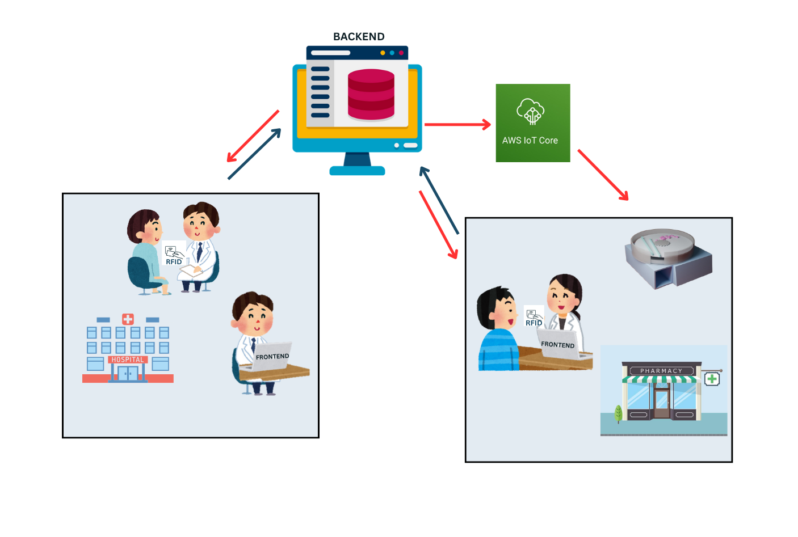

# 🩺 MediFlow - Smart Medicine Dispenser System

## 📝 Project Overview

MediFlow is a smart medicine dispenser system developed to improve efficiency and reliability in hospital pharmacies. It integrates a web-based software system with IoT-enabled hardware to automate the dispensing of common medicines, reducing queues and manual errors.

The system allows doctors to issue digital prescriptions, pharmacists to manage queues, and patients to receive medicines quickly through automated dispensers controlled by microcontrollers.

This project is part of our Third Year Project (3YP) at the Department of Computer Engineering, University of Peradeniya. It contributes to four academic modules:

- **Embedded Systems**
- **Network & Web Application Design**
- **Software Engineering**
- **Computer & Network Security**

## 📦 Features

- ✅ Automated medicine dispensing using ESP32 + SMT8 microcontrollers
- 💊 Doctor-side prescription portal
- 📱 RFID-based patient identification and Temporary Prescription ID system
- 🏥 Pharmacy interface for managing queues and medicine delivery
- 🌐 Web application with real-time updates
- 📋 Prescription tracking and availability management
- 🔒 Secure, scalable, and modular design

## 📁 Repository Structure

```
MediFlow/
├── code/
│   ├── backend/         # Express.js backend server
│   ├── frontend/        # React frontend application
│   ├── firmware/        # Firmware for ESP32 and SMT8 microcontrollers
│   └── docker-compose.yml
├── docs/                # Diagrams, documentation, and reports
├── testing/             # Testing files and configurations
├── README.md            # Project overview and instructions
```

## 🛠️ Tech Stack

- **Frontend:** React.js with TypeScript
- **Backend:** Node.js + Express
- **Database:** PostgreSQL
- **Embedded System:** ESP32, SMT8
- **Communication:** HTTP, Serial
- **Authentication:** RFID
- **Deployment:** Docker, AWS
- **Testing:** Selenium (Java)

## 🚀 How to Run

### Backend:
```bash
cd code/backend
npm install
npm run dev
```

### Frontend:
```bash
cd code/frontend
npm install
npm start
```

### Firmware:
- Upload the ESP32 code from `code/firmware/` using Arduino IDE or PlatformIO
- Configure the microcontroller settings in `platformio.ini`

## 🔐 Security, Availability & Reliability

- 🔑 RFID-based patient identity verification
- 🛡️ HTTPS (planned) and authentication mechanisms
- ⚡ Microcontroller fail-safe logic and retry mechanisms
- 📊 Centralized logging and monitoring
- 🔧 Modular hardware units for fault isolation and scaling

## 📷 Diagrams & Screenshots

### System Architecture


### System Design


## ✅ Project Features

- ✅ Doctor and Pharmacy web interfaces
- ✅ RFID + Prescription ID mechanism
- ✅ ESP32 + SMT8 dispenser control
- ✅ Patient queuing system
- ✅ Dispenser scalability for more compartments
- ✅ Full system integration and testing
- ✅ AWS deployment

## 👨‍💻 Team Members

- **E/20/087:** Supun Dulara - [e20087@eng.pdn.ac.lk](mailto:e20087@eng.pdn.ac.lk)
- **E/20/094:** Ishara Ekanayaka - [e20094@eng.pdn.ac.lk](mailto:e20094@eng.pdn.ac.lk)
- **E/20/131:** S.T.S Hasantha - [e20131@eng.pdn.ac.lk](mailto:e20131@eng.pdn.ac.lk)
- **E/20/179:** Kusal Jayawardhana - [e20179@eng.pdn.ac.lk](mailto:e20179@eng.pdn.ac.lk)

## 📄 License

This project is developed for academic purposes only. For reuse, collaboration, or licensing, please contact the team.

---

*Department of Computer Engineering, University of Peradeniya*
